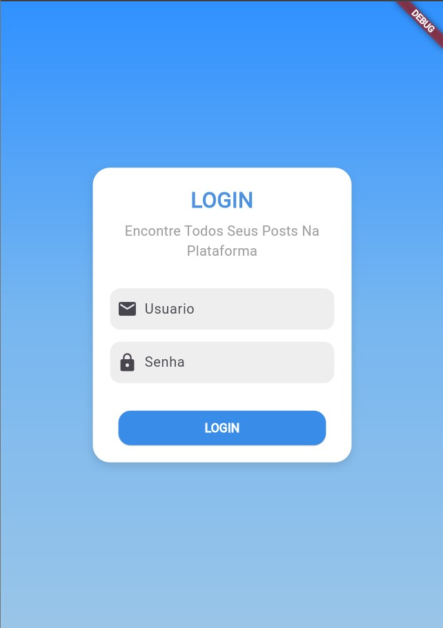
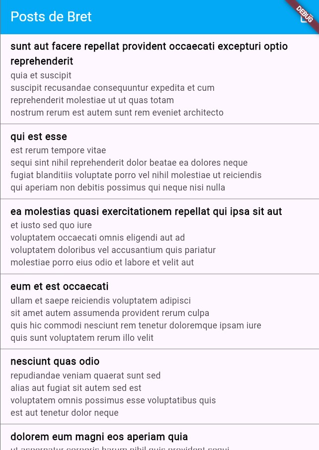
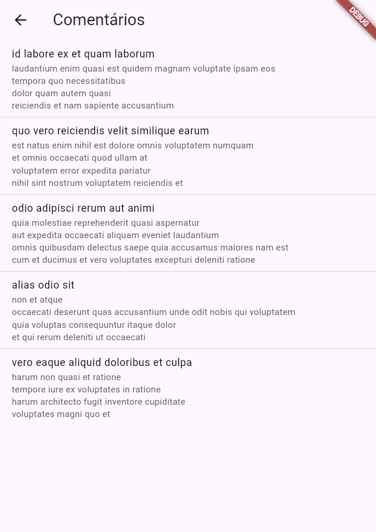

# Peki Code - Plano de desenvolvimento Individual (PDI)

<figure>

  

 

Olá, seja bem-vindo ao meu repositório do meu Plano de Desenvolvimento Individual na Empresa Júnior do Instituto Federal Goiano - Campus Morrinhos, Peki Code. Abaixo, você verá tudo o que foi feito e estudado durante este PDI.

 

## Tecnologias 

* [Dart - Flutter]
* [Desenvovlimento Mobile]

 

## :clipboard:  Sobre os Cursos 

* [Flutterando TV - Curso Flutter 2022](https://www.youtube.com/watch?v=Wdn6peqH9ZQ&list=PLlBnICoI-g-fuy5jZiCufhFip1BlBswI7)

### Mateiral de apoio

* [Documentação Flutter by Google](https://docs.flutter.dev/get-started/codelab)
  

## :clipboard: Overview

### Conteúdos a ser estudado
##### Importante manter o README do seu PDI sempre atualizado para que possamos acompanhar o seu desenvolvimento na Peki Code!

- [x] ~~Flutter Curso 2022 #1 - Seja bem-vindo!~~
- [x] ~~Flutter Curso 2022 #2 - Instalando o Flutter~~
- [x] ~~Flutter Curso 2022 #3 - Instalando o VSCode~~
- [x] ~~Flutter Curso 2022 #4 - Pastas de projeto~~
- [x] ~~Flutter Curso 2022 #5 - Conhecendo o Hot Reload~~
- [x] ~~Flutter Curso 2022 #6 - Os botões de depuração do VSCode~~
- [x] ~~Flutter Curso 2022 #7 - Criação de widgets~~
- [x] ~~Flutter Curso 2022 #8 - O MaterialApp~~
- [x] ~~Flutter Curso 2022 #9 - ErrorLens e lint~~
- [x] ~~Flutter Curso 2022 #10 - O Scaffold~~
- [x] ~~Flutter Curso 2022 #11 - Componentizando widgets~~
- [x] ~~Flutter Curso 2022 #12 - Primeira e última aula sobre InheritedWidget~~
- [x] ~~Flutter Curso 2022 #13 - O StatefulWidget~~
- [x] ~~Flutter Curso 2022 #14 - (Columns e Rows) eixos~~
- [x] ~~Flutter Curso 2022 #15 - (Columns e Rows) prática~~
- [x] ~~Flutter Curso 2022 #16 - Scroll~~
- [x] ~~Flutter Curso 2022 #17 - ListView~~
- [x] ~~Flutter Curso 2022 #18 - Exemplo prático de uso~~
- [x] ~~Flutter Curso 2022 #19 - Stack~~
- [x] ~~Flutter Curso 2022 #20 - Usando o Image.network~~
- [x] ~~Flutter Curso 2022 #21 - Acessando imagens locais~~
- [x] ~~Flutter Curso 2022 #22 - Stack como máscara~~
- [x] ~~Flutter Curso 2022 #23 - Stack com Rows e Columns~~

## Projeto:  Comunicação Rest

## Resposnaveis pelo PDI na Peki Code

* [Arthur Miranda](https://github.com/devarthurmiranda)
* [Carlos Eduardo Rocha Miranda](https://github.com/CarlosERM)
* [João Victor Rocha Vilela godoi](https://github.com/Joao-Victor-RVG)
* [Matheus Fellipe](https://github.com/MatheusFellipi)
